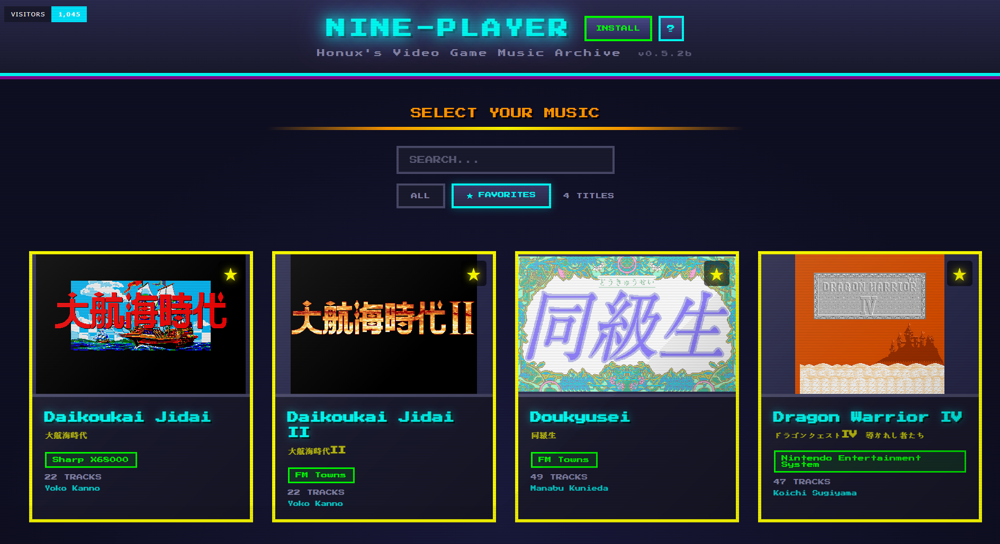
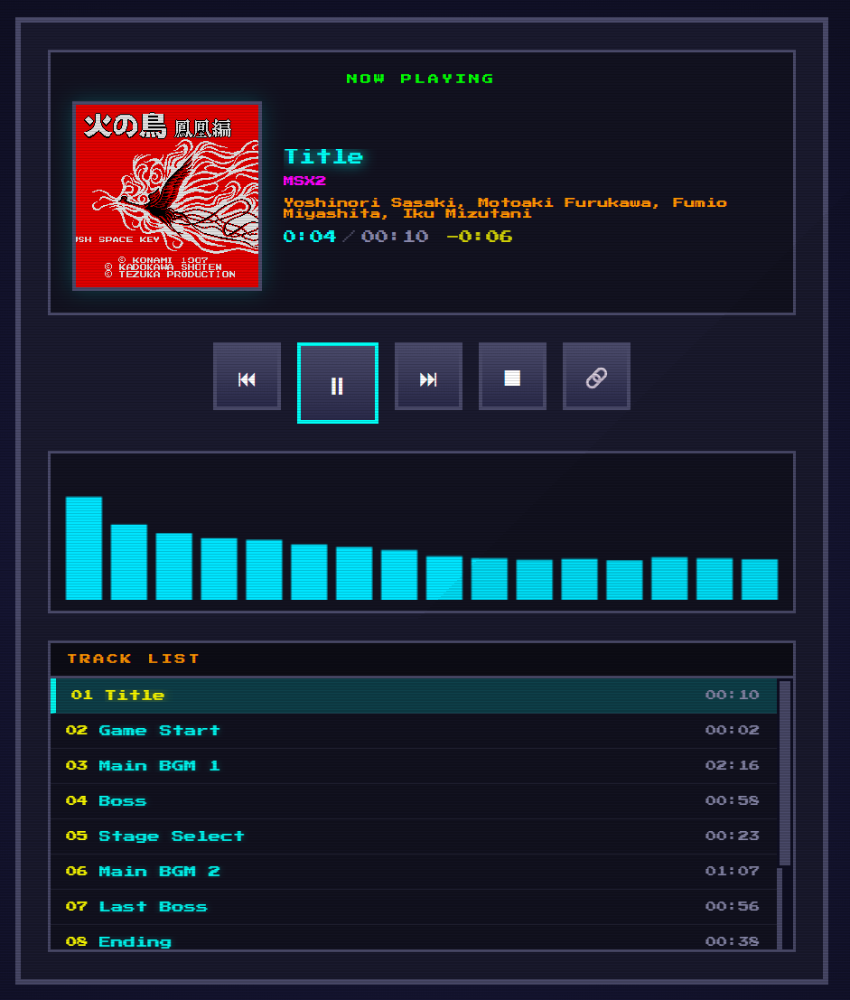
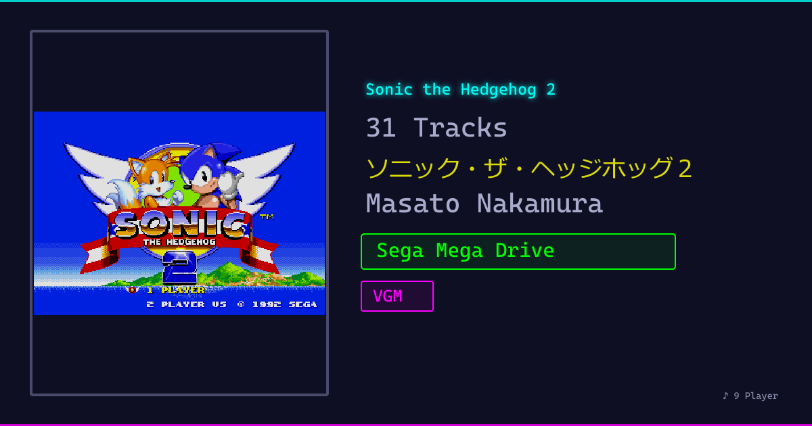

# 9-Player (舊-Player)

> **9 = 舊 (구)** - 옛것을 플레이하다

레트로 게임 음악(VGM/SPC)을 브라우저에서 재생하는 모던 웹 플레이어입니다.



## Features

- **Multi-Format Playback** - VGM/VGZ (Mega Drive, MSX 등) 및 SPC (Super Nintendo) 재생 지원
- **Real-time Audio Visualization** - 주파수 스펙트럼 시각화
- **Cover Art Display** - 앨범 커버 이미지 확대 보기 (CRT 스캔라인 이펙트)
- **Responsive Design** - 데스크탑/모바일 반응형 지원
- **Auto-play** - 트랙 자동 재생 및 다음 곡 넘기기
- **Progress Bar** - 실제 재생 진행률 표시
- **Keyboard Shortcuts** - 키보드로 빠른 조작
- **URL Sharing** - 특정 곡을 URL로 직접 공유 가능
- **Dynamic OG Tags** - 공유 시 게임/트랙 정보가 미리보기에 표시
- **Favorites** - 앨범 즐겨찾기 및 필터링 (localStorage 저장)
- **Search** - 게임 타이틀 검색
- **PWA Support** - 앱으로 설치 가능

## Screenshots

### Player



### OG Preview

공유 링크의 미리보기에 게임 커버, 트랙 수, 작곡가, 시스템 정보가 표시됩니다.



## URL Sharing

재생 중인 곡의 URL을 공유하면 해당 곡이 바로 재생됩니다.

```
https://9-player.vercel.app/?game=GameID&track=TrackName
```

- 🔗 버튼으로 현재 곡 URL 복사
- URL로 접속하면 해당 곡 자동 재생

## Keyboard Shortcuts

| Key | Action |
|-----|--------|
| `Space` | Play / Pause |
| `N` | Next Track |
| `P` | Previous Track |
| `S` | Stop |
| `ESC` | Back to Album List |

## Supported Formats

| Format | System | Engine |
|--------|--------|--------|
| VGM/VGZ | Mega Drive, Master System, Game Gear, MSX 등 | VGMPlay (WebAssembly) |
| SPC | Super Nintendo (SNES) | SPC Engine (iframe 격리) |

지원 사운드 칩: YM2612, SN76489, YM2151, AY-3-8910, SPC700 등

## Tech Stack

- **Frontend**: React 19 + Vite 7
- **Audio Engine**: VGMPlay (WebAssembly/Emscripten), SPC Engine
- **Styling**: CSS with CSS Variables
- **PWA**: vite-plugin-pwa
- **Storage**: localStorage (favorites)
- **Deploy**: Vercel (Edge Middleware for dynamic OG tags)

## Getting Started

### Development

```bash
cd frontend
npm install
npm run dev
```

### Generate Manifest

음악 파일(VGZ/SPC ZIP)에서 메타데이터를 추출하고 OG 이미지를 생성합니다.

```bash
cd frontend
npm run generate-manifest
```

### Build

```bash
cd frontend
npm run build
```

### Deploy to Vercel

1. Vercel에서 GitHub 리포지토리 연결
2. Root Directory: `frontend`
3. Deploy

## Credits

- Original [vgmplay-js](https://github.com/nickvlessert/vgmplay-js-2) by Niek Vlessert
- [VGMPlay](https://github.com/vgmrips/vgmplay) - VGM playback library
- Music files from [VGMRips](https://vgmrips.net)

## License

MIT License
